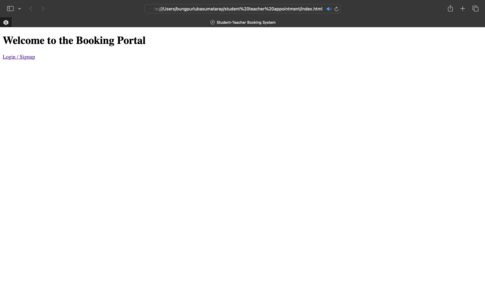
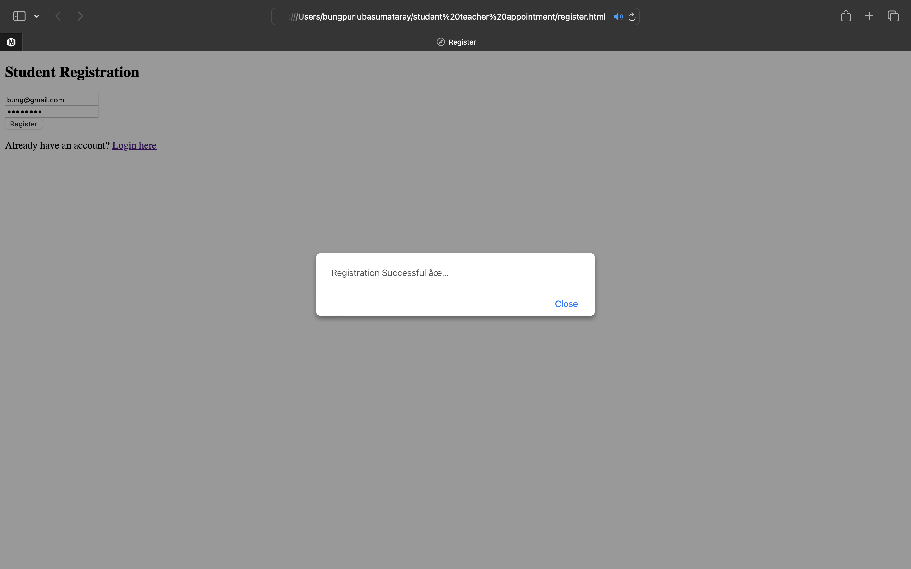
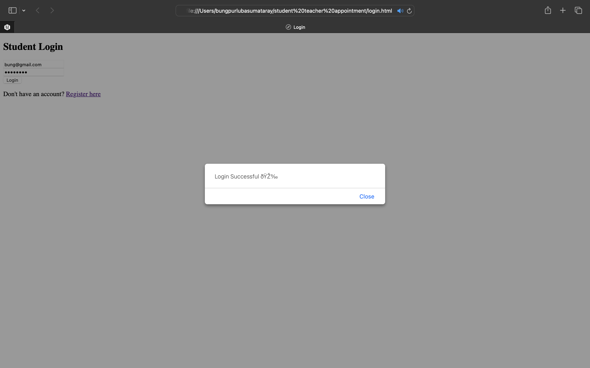
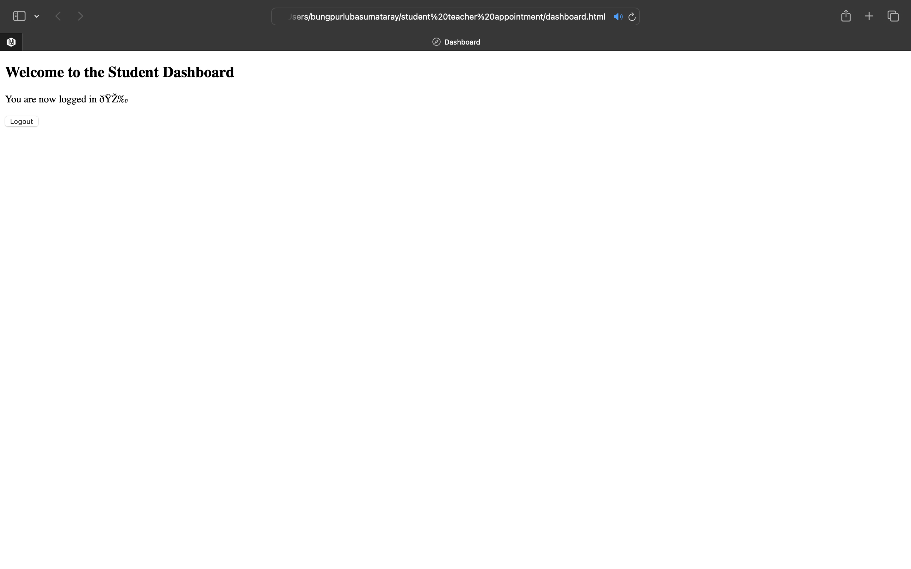
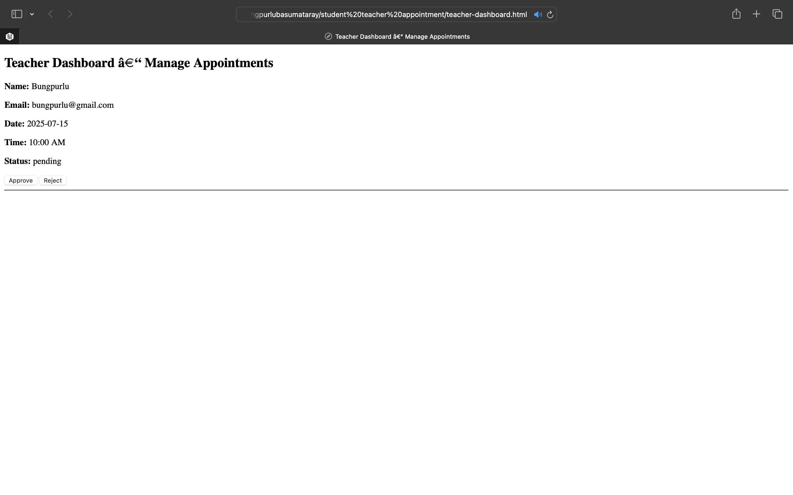
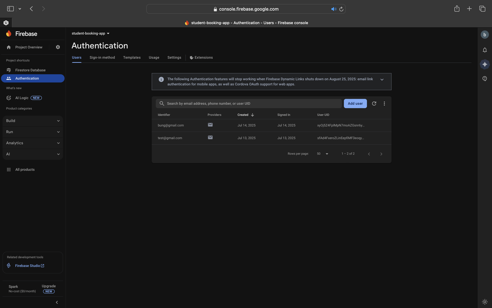
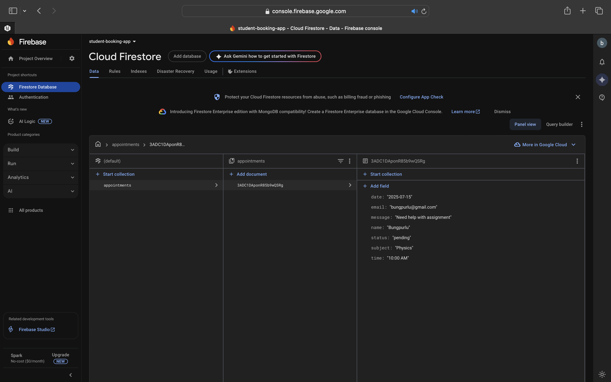

# 👨‍🏫 Student-Teacher Appointment Booking System

A web-based system that allows students to register, search teachers, and book appointments. Teachers can manage appointments via a simple dashboard.

---

## 🚀 Technologies Used
- HTML
- CSS
- JavaScript (modular)
- Firebase (Authentication + Firestore)

---

## 🔐 User Roles & Features

### 👨‍🎓 Student
- Register/Login
- Search Teachers
- Book Appointments
- Send Messages

### 👩‍🏫 Teacher
- Login
- View Appointments
- Approve / Cancel Appointments
- View Messages

---

## 🖼️ Screenshots

### 🔹 Home Page

### 🔹 Student Registration

### 🔹 Login Page

### 🔹 Student Dashboard

### 🔹 Teacher Dashboard

### 🔹 Firebase Authentication

### 🔹 Firebase Firestore

---

## 🔧 How to Run

1. Clone this repo  
2. Open `index.html` in your browser  
3. Make sure Firebase config is correct in `firebase/firebaseConfig.js`  
4. All data will be stored in Firestore

---

## 📁 Project Structure
student-teacher-booking/
│
├── index.html
├── login.html
├── register.html
├── dashboard.html
├── book.html
├── teacher-dashboard.html
│
├── css/
│ └── styles.css
│
├── js/
│ ├── auth.js
│ └── teacher-dashboard.js
│
├── firebase/
│ └── firebaseConfig.js
│
└── screenshots/
└── *.png

---

## ✅ Status
✔️ Firebase Integrated  
✔️ Authentication & Booking Working  
✔️ Modular Code  
✔️ Logging (planned)

---

## ✍️ Author
**Bungpurlu Basumatary**

---

